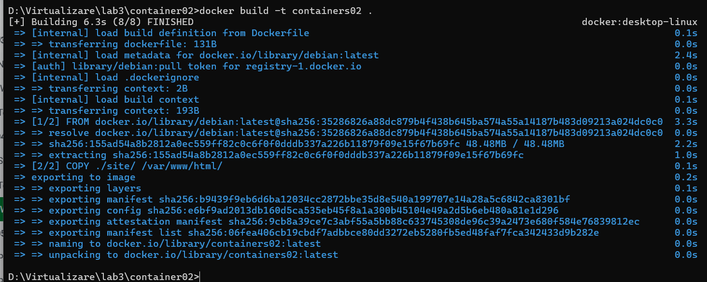
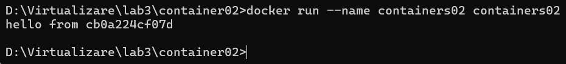
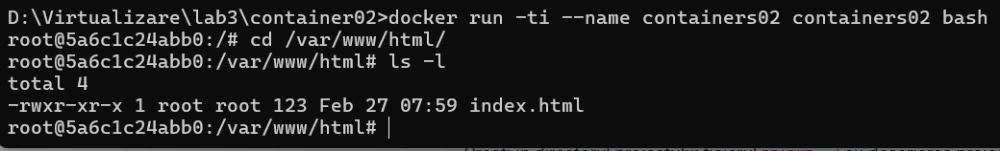

#  Prima aplicație Docker

## Scop

Aceasta lucrare de laborator ne familiarizează cu elementele de bază ale containerizării și ne pregătește spațiul de lucru pentru următoarele lucrări de laborator.

## Sarcina

1. Instalarea Docker Desktop și verificarea funcționării acestuia.
2. Crearea unui proiect pentru un container simplu utilizând imaginea Debian.
3. Pornirea și testarea containerului creat.

## Descrierea executării lucrării

### 1. Instalarea Docker Desktop

- Am descărcat și instalat Docker Desktop conform instrucțiunilor oficiale.
- Am verificat funcționarea rulând comanda `docker --version`, confirmând astfel instalarea cu succes.

### 2. Configurarea proiectului

- Am creat un director numit `containers02` și l-am clonat pe computerul local.
- În directorul `containers02`, am creat fișierul `Dockerfile` cu următorul conținut:
  ```dockerfile
  FROM debian:latest
  COPY ./site/ /var/www/html/
  CMD ["sh", "-c", "echo hello from $HOSTNAME"]
  ```
- Am creat directorul `site` în cadrul proiectului și am adăugat fișierul `index.html` cu un conținut la alegere:
  ```html
  <html>
    <head>
        <title>Docker</title>
    </head>
    <body>
        <h1>Salut, sunt Bogdan</h1>
    </body>
  </html> 
  ```

### 3. Crearea imaginii Docker

- În terminal, am rulat comanda:
  ```bash
  docker build -t containers02 .
  ```
- Crearea imaginii a durat aproximativ 6.2 secunde.


### 4. Pornirea și testarea containerului

- Am pornit containerul cu comanda:
  ```bash
  docker run --name containers02 containers02
  ```
  Rezultatul afișat în consolă a fost:


- Am șters containerul cu comanda:
  ```bash
  docker rm containers02
  ```

- L-am repornit în modul interactiv cu:
  ```bash
  docker run -ti --name containers02 containers02 bash
  ```
  În această sesiune am executat:
  ```bash
  cd /var/www/html/
  ls -l
  ```
  Fișierul `index.html` a fost afișat, confirmând copierea corectă a datelor în container.
  

### 5. Închiderea containerului

- Am închis containerul utilizând comanda `exit`.

## Concluzii

Această lucrare de laborator a introdus elementele de bază ale utilizării Docker. Am învățat să:

1. Instalăm și configurăm Docker Desktop.
2. Creăm o imagine Docker utilizând un fișier Dockerfile.
3. Testăm și gestionăm un container creat.

## Bibliografie

- [Documentația oficială Docker](https://docs.docker.com/)
